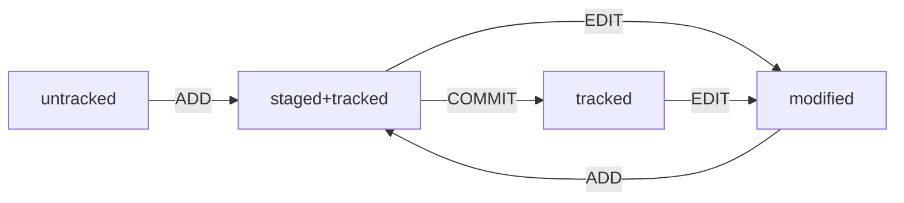

## Шпаргалка по git
**Git (Global Information Tracker) - система контроля версий (Version Control System - VCS)**, позволяющая хранить, изменять и анализировать историю изменений продукта, а также синхронизировать изменения между участниками команды.

Git реализует интерфейс командной строки - Command-line Interface (CLI).


### Базовые команды CLI:
```bash
pws, cd, ls, touch, mkdir, mkdir -p, 
cp что [что[ что]] куда, mv, cat, rmdir, rm -r, 
grep, clip, pbcopy (mac)
~  &&  ||  &  |  ;  !!  !$  !^  !:2
```

### Настройки git
~/.gitconfig
```bash
git config -l
git config user.name "" && git config user.email ""
```

#### Инициализация
```bash
git init
```

#### Генерация SSH
**SSH (Secure Shell Protocol)** - протокол обмена данными по сети. Для Git генерируется два ssh-ключа в ~/.ssh. 
```bash
ssh-keygen -t ed25519 -C "git@email"
ssh-keygen -t rsa -b 4096 -C "git@mail"
ssh -T git@github.com # проверка
```

#### Добавление удаленного репозитория
```bash
git remote add origin адрес
git remote -v # проверка
```

#### Обслуживание 
```bash
git status
```
```bash
git add --all
```

```bash
git commit -m ""
```
```bash
git log
git log --oneline
```

```bash
# для локальных коммитов
git commit --amend -m ""
git commit --amend --no-edit
```

#### Отправка изменений
```bash
git push -u origin main # для новых веток
```

#### Работа с ветками
```bash
git branch -M main
```

### Хэш
**Хэш коммита** - уникальный идентификатор коммита, созданный при помощи SHA-1 (Secure Hash Algorithm) на основе времени коммита, его содержании, автора и ссылки на родительский коммит. Хэш в Git состоит из 40 символов (0 - 9, A - F). Хэши совпадающих данных одинаковы при использовании одного алгоритма хэширования.

### Файл HEAD
Файл **HEAD** - служебный файл, содержащий путь к другому файлу (например, refs/heads/master) с хэшем последнего выполненного коммита.

### Статусы файлов
- untracked/tracked;
- modified;
- staged.

tracked = modified || staged || modified && staged



### Откат изменений
```bash
git restore --staged .
```